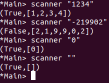
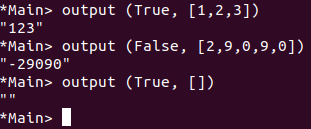
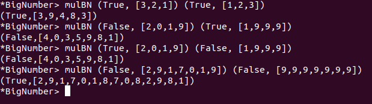
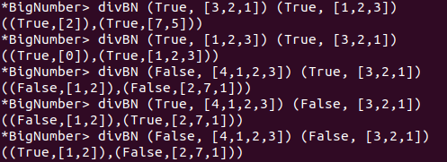
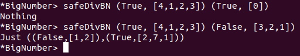

# PFL-Trabalho Prático 1

Contextualização e explicação da resolução dos exercícios do Trabalho Prático 1 da unidade curricular de Programação Funcional em Lógica.

---

## 1.1. fibRec

## 1.2. fibLista

## 1.3. fibListaInfinita

---

## 2.1. BigNumber

Implementação do type BigNumber, constituído por um Bool e uma lista de Int's. O Bool guarda o sinal do número, True se for positivo e False se for negativo, e a lista guarda os dígitos do número.

## 2.2. scanner

Esta função converte uma string num BigNumber. Aplica a função read após aplicar a função (:"") que torna cada char numa string, a cada um dos elementos da string str (lista de chars) criando listas individuais de cada um dos números e depois aplica map para criar uma lista de todos os dígitos de str.

### **Casos de teste**

## 2.3. output

Esta função converte um BigNumber numa string. Aplica a função show que dá pre-append a todos os elementos de bigNum através da função map.

### **Casos de teste**

## 2.4. somaBN

## 2.5. subBN

## 2.6. mulBN

Esta função multiplica 2 BigNumbers chamando a função auxiliar "mulAux" com os mesmos argumentos da "mulBN", exceto os sinais que são considerados como positivos para facilitar o cálculo.
A função "mulAux" aplica um algoritmo semelhante à multiplicação manual de forma recursiva. O argumento "BigNum2" é multiplicado por cada número do argumento "BigNum1", começando pelo menos significativo, sendo que em cada iteração é adicionado um zero à direita do "BigNum2" e retirado do "BigNum1" o elemento menos significativo. O caso base da função é quando o "BigNum1" têm uma lista vazia. Todas as iterações são somadas para ser obtido o resultado final.
O sinal do resultado final é obtido através de um "AND" lógico dos sinais dos argumentos.

### **Casos de teste**

## 2.7. divBN

Esta função divide 2 BigNumbers chamando a função auxiliar "divAux" com os mesmos argumentos da "divBN", exceto os sinais que são considerados como positivos para facilitar o cálculo.
O "divAux" é uma função recursiva que em cada iteração subtrai ao argumento "BigNum1" (numerador) o "BigNum2" (denominador), parando quando o numerador for menor que o denominador. O número de iterações é somado para obter o quociente, consequentemente o resto é obtido através da fórmula: " resto = numerador - denominador*quociente ". 
O sinal do resultado final é obtido através de um "AND" lógico dos sinais dos argumentos.

### **Casos de teste**

---

## 3.1. fibRecBN

## 3.2. fibListaBN

## 3.3. fibListaInfinitaBN

---

## 4. Comparação

---

## 5. safeDivBN

Esta função divide 2 BigNumbers, porém deteta e impede em compile-time que o denominador seja 0.

### **Casos de teste**

---

Grupo 506, 28/11/2021

* João Andrade, up201905589@up.pt
* Sérgio Estêvão, up201905680@up.pt
